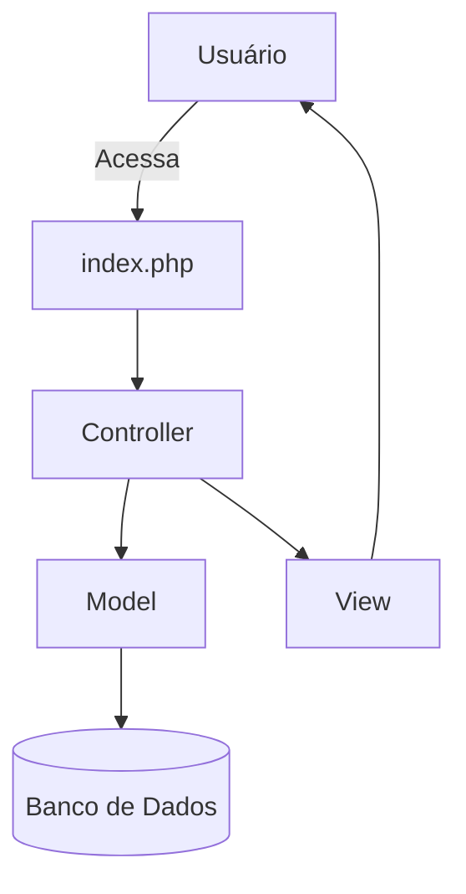

# 🏢 Sistema de Cadastro e Consulta de Produtos  
*(Primeira atividade avaliativa – 31/08/2025)*

Este é um sistema simples em **PHP (PDO)** para cadastro e consulta de produtos.  
Projeto feito em **arquitetura MVC**, com um visual **futurista e moderno** usando CSS.

---

## 📌 Funcionalidades
- 📥 Cadastro de produtos  
- 🔍 Consulta de todos os produtos em tabela  
- 🖥️ Interface futurista com CSS  
- 🔗 Estrutura em **MVC** (Model, View, Controller)  
- 🔒 Uso de **PDO** para maior segurança contra SQL Injection  

---

## 🛠️ Tecnologias Utilizadas
- PHP 8+
- MySQL
- PDO
- HTML5
- CSS3

---
 📂 Estrutura de Pastas


```bash
/empresa
│── index.php                 # Menu principal
│
├── configuration/
│   └── config.php            # Conexão com banco (PDO)
│
├── model/
│   └── Produto.php           # Model (Produto)
│
├── controller/
│   └── ProdutoController.php # Controller principal
│
├── view/
│   ├── cadastro.php          # Formulário de cadastro
│   └── consulta.php          # Lista de produtos
│
└── public/
    └── style.css             # Estilo futurista

```


---

## 🗄️ Banco de Dados

Crie o banco `empresa` no MySQL:

```sql
CREATE DATABASE empresa;
USE empresa;

CREATE TABLE produtos (
    codigo VARCHAR(50) PRIMARY KEY,
    produto VARCHAR(100) NOT NULL,
    data_validade VARCHAR(20),
    preco DECIMAL(10,2)
);
```
## ▶️ Como Rodar o Projeto

Clone este repositório:

git clone https://github.com/Vini-Gregorio/programacaoWeb_4ads.git

Coloque a pasta dentro do seu servidor local (htdocs no XAMPP ou www no WAMP).

Renomeie para apenas "conexao" e configure o banco de dados no arquivo:

configuration/conexaoexemplo.php


Acesse no navegador:

https://localhost/empresa/

---
## 📊 Fluxo MVC


---

Menu principal

Tela de cadastro

Tela de consulta

---
##🚀 Melhorias Futuras

🔑 Autenticação de usuários (login/logout)

📱 Layout responsivo (mobile friendly)

🗂️ Exportar lista de produtos em PDF/Excel

🐳 Docker para rodar em qualquer ambiente

---

Este projeto está sob a licença MIT.
Sinta-se livre para usar, modificar e compartilhar. 😃


